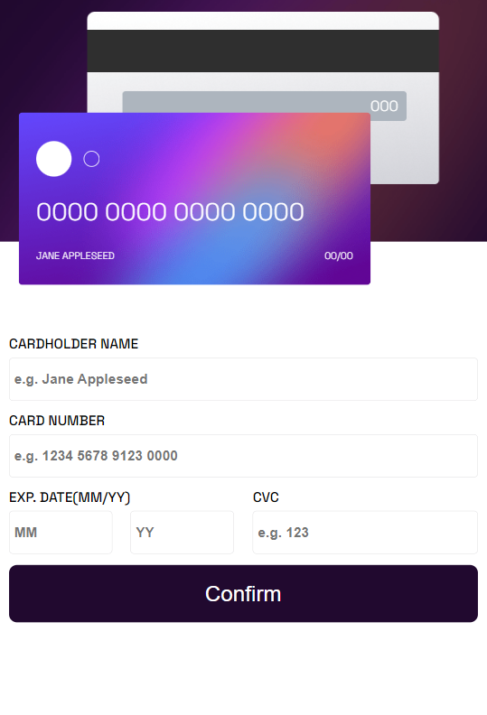
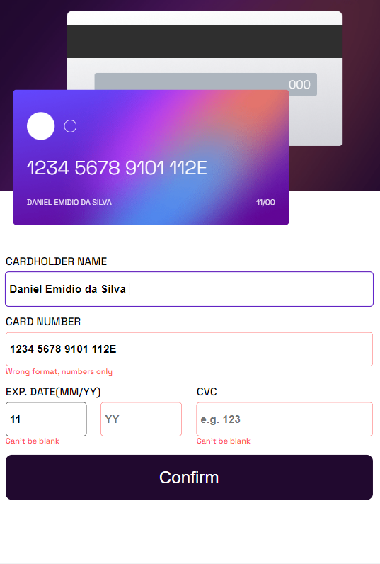
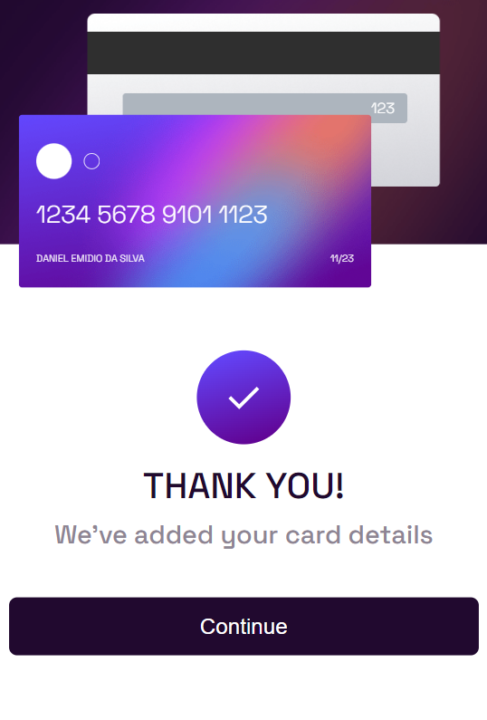
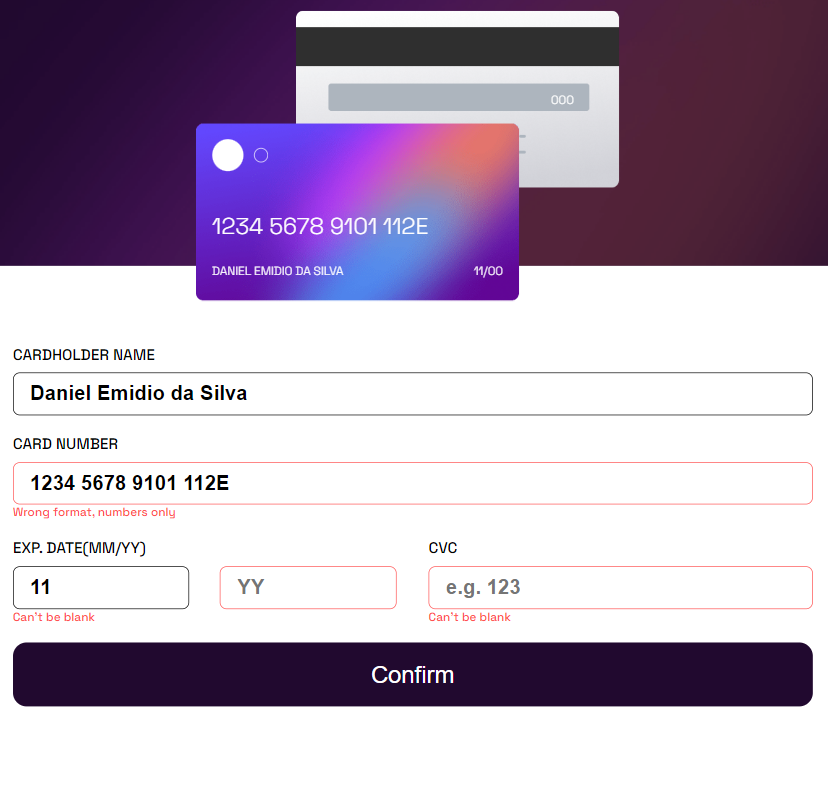
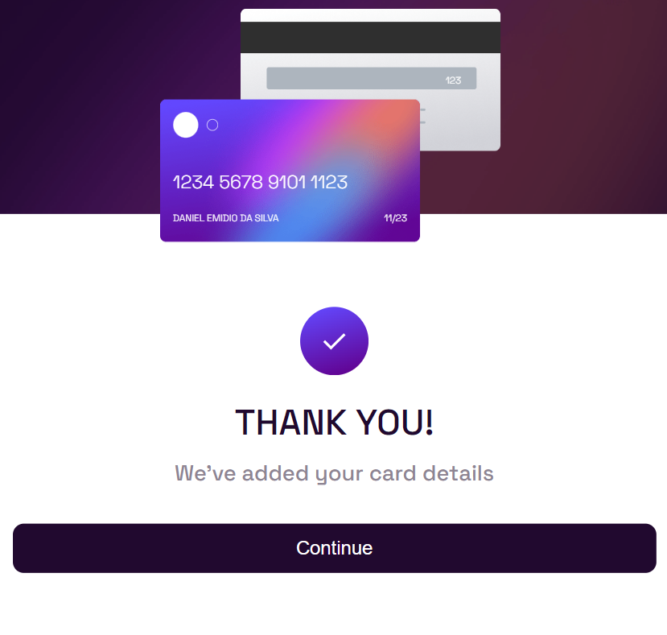
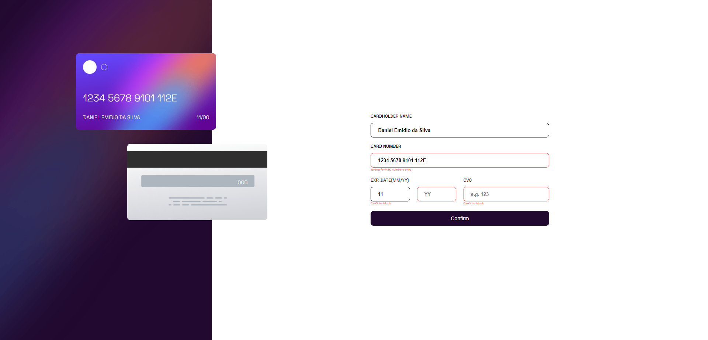
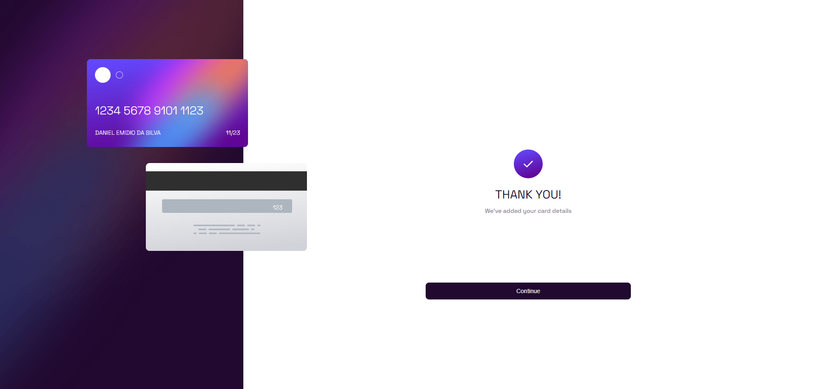

# Frontend Mentor - Solução de formulário interativo de detalhes do cartão

Esta é uma solução para o desafio [Interactive card details form challenge on Frontend Mentor](https://www.frontendmentor.io/challenges/interactive-card-details-form-XpS8cKZDWw). Os desafios do Frontend Mentor ajudam a melhorar suas habilidades de codificação criando projetos realistas.

## Sumário

- [Overview](#visão-geral)
  - [O Desafio](#o-desafio)
  - [Screenshot](#screenshot)
  - [Links](#links)
- [Meu Processo](#meu-processo)
  - [Construido com](#construido-com)
- [Autor](#autor)

## Visão Geral

### O Desafio
Os usuários devem ser capazes de:

- Preencher o formulário e ver os detalhes do cartão serem atualizados em tempo real
- Receber mensagens de erro quando o formulário é enviado se:
  - Qualquer campo de entrada estiver vazio
  - O número do cartão, data de validade ou o código CVC estiverem no formato incorreto
- Visualizar o layout ideal dependendo do tamanho da tela do dispositivo
- Ver estados de hover, ativo e foco para elementos interativos na página

### Screenshot

#### Mobile
|  Padrão |  Ativo |  Sucesso |
| :---: | :---: | :---: | 

#### Tablet
|  Padrão |  Ativo |  Sucesso |
| :---: | :---: | :---: | 

#### Desktop
|  Padrão |  Ativo |  Sucesso |
| :---: | :---: | :---: | 

### Links

- URL da solução: Adicione a URL da solução aqui
- URL do site ao vivo: Adicione a URL do site ao vivo aqui

## Meu processo

### Construido com
- Marcação semântica HTML5
- Styled-Components
- 'Mobile-First'
- React - biblioteca JS

### Autor
| [ Daniel Emidio](https://github.com/DanielEmidio1988) |
| :---: |
