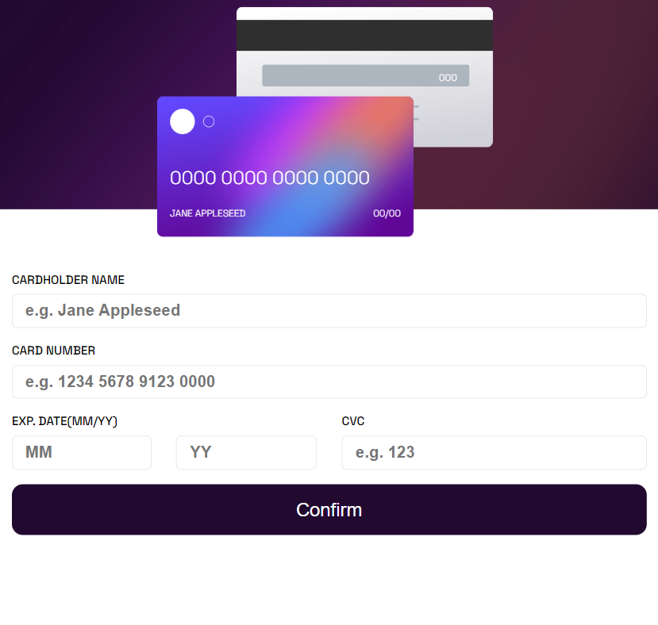

# Frontend Mentor - Solução de formulário interativo de detalhes do cartão

Esta é uma solução para o desafio [Interactive card details form challenge on Frontend Mentor](https://www.frontendmentor.io/challenges/interactive-card-details-form-XpS8cKZDWw). Os desafios do Frontend Mentor ajudam a melhorar suas habilidades de codificação criando projetos realistas.

## Sumário

- [Overview](#visão-geral)
  - [O Desafio](#o-desafio)
  - [Screenshot](#screenshot)
  - [Links](#links)
- [Meu Processo](#meu-processo)
  - [Construido com](#construido-com)
  - [O que aprendi](#o-que-aprendi)
- [Autor](#autor)

## Visão Geral

### O Desafio
Os usuários devem ser capazes de:

- Preencher o formulário e ver os detalhes do cartão serem atualizados em tempo real
- Receber mensagens de erro quando o formulário é enviado se:
  - Qualquer campo de entrada estiver vazio
  - O número do cartão, data de validade ou o código CVC estiverem no formato incorreto
- Visualizar o layout ideal dependendo do tamanho da tela do dispositivo
- Ver estados de hover, ativo e foco para elementos interativos na página

### Screenshot

#### Mobile
| <br><sub>Padrão</sub> | <br><sub>Ativo</sub> | <br><sub>Sucesso</sub> |
| :---: | :---: | :---: | 


#### Tablet
| <br><sub>Padrão</sub> | <br><sub>Ativo</sub> | <br><sub>Sucesso</sub> |
| :---: | :---: | :---: | 

#### Desktop
| <br><sub>Padrão</sub> | <br><sub>Ativo</sub> | <br><sub>Sucesso</sub> |
| :---: | :---: | :---: | 

### Links

- URL da solução: [clique aqui](https://formulario-cartao.vercel.app/)

## Meu processo

### Construido com
- Marcação semântica HTML5
- Styled-Components
- 'Mobile-First'
- React - biblioteca JS

### O Que Aprendi

Durante este projeto, um dos pontos que gostei bastante de ter aprendido foi sobre a validação do número do cartão. No meu código, eu o apliquei em 3 funções, sendo o primeiro para validar os dados inserindo no Cartão, o segundo para formatar os dados no formato do cartão e o terceiro dentro do próprio onChange para que o usuário tenha ciência que digitou um valor inválido. 

- validateForm()
```bash
      const cardNumber = props.accountClient.numbercard.replace(/\s+/g, '');
      if (!/^\d{16}$/.test(cardNumber)) {
        document.getElementsByName('numbercard')[0].style.borderColor = 'hsl(0, 100%, 66%)';
        setValidateCardNumber(false);
        props.accountClient.numbercard === '' ? setErrorMessageErrorCardNumber(`Can't be blank`) : setErrorMessageErrorCardNumber(`Wrong format, numbers only`)
        isValid = false;
      } else {
        document.getElementsByName('numbercard')[0].style.borderColor = 'initial';
        setValidateCardNumber(true);
      }
```

- formatCardNumber()
```bash
    function formatCardNumber(number) {
      // Daniel: Remove todos os espaços do número do cartão
      const cleanNumber = number.replace(/\s+/g, '');
  
      // Daniel: Adiciona um espaço a cada 4 caracteres
      const formattedNumber = cleanNumber.replace(/(\d{4})/g, '$1 ');
  
      // Daniel: Retorna o número formatado
      return formattedNumber;
    }

```

- onChangeAccountForm()
```bash
const formattedNumber = formatCardNumber(event.target.value);   
          const cardNumber = event.target.value;    
          if(isNaN(cardNumber.replace(/\s+/g, ''))){
            setErrorMessageErrorCardNumber(`Wrong format, numbers only`)
            document.getElementsByName('numbercard')[0].style.borderColor = 'hsl(0, 100%, 66%)'
            setValidateCardNumber(false)
          }else{
            document.getElementsByName('numbercard')[0].style.borderColor = 'initial';
            
            setValidateCardNumber(true)
          }
          props.setAccountClient({ ...props.accountClient, [event.target.name]: formattedNumber });
```


### Autor
| [<br><sub>Daniel Emidio</sub>](https://github.com/DanielEmidio1988) |
| :---: |
